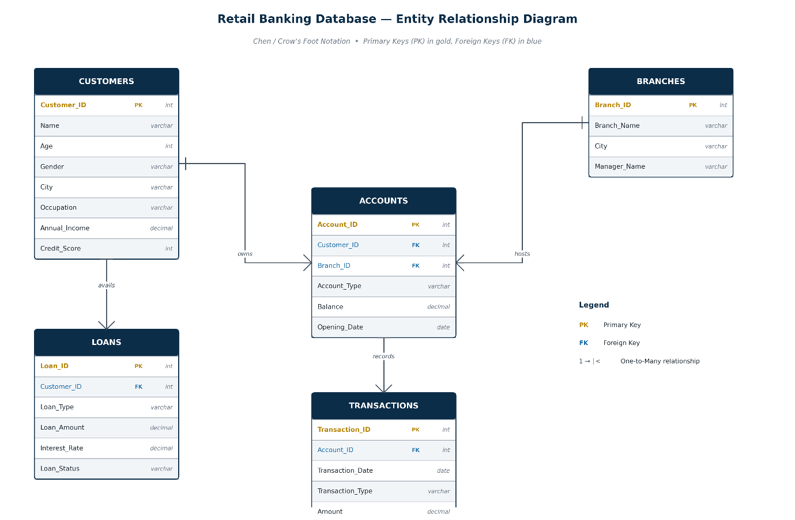
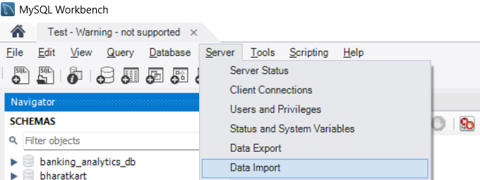
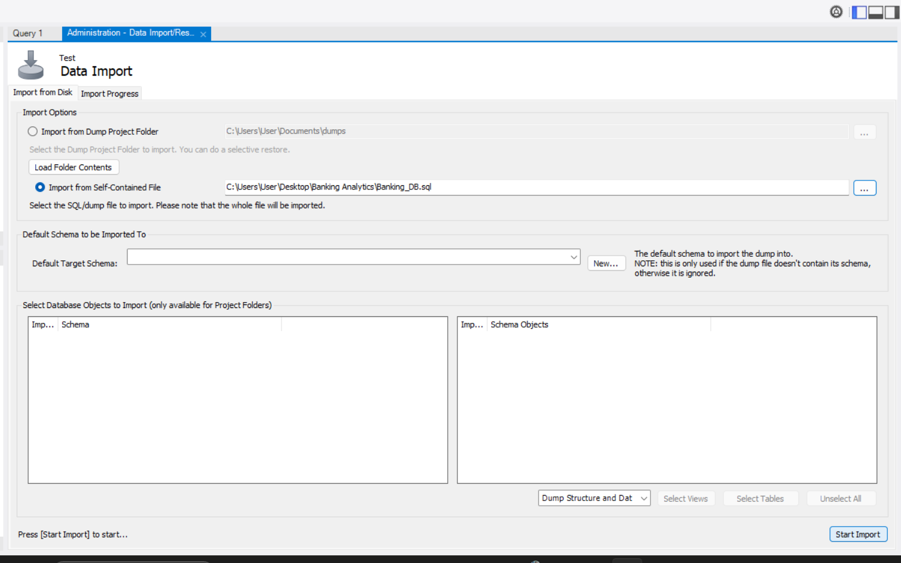
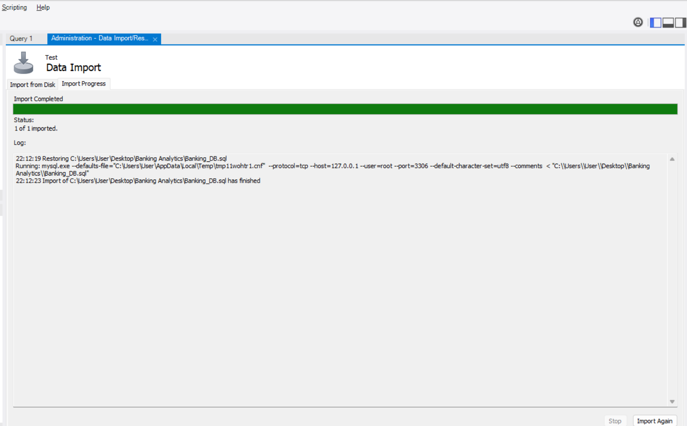

# Banking-Analytics-End-to-End


# Abstract:

The banking industry generates vast amounts of transactional and
customer data every day, making effective data management essential for
informed decision-making.

This project presents the design and development of an end-to-end
Banking Analytics System that integrates **relational database
management (RDBMS) with SQL analytics** and interactive business
intelligence dashboards.

The project begins with the design of a normalized relational database,
ensuring data integrity through appropriate primary keys, foreign keys,
constraints, and relationships.

The synthetic banking dataset was generated using Python. The **Faker**
library was used to create realistic customer and employee information,
while Python\'s built-in **random** and **datetime** modules generated
financial values, account details, transaction records, and temporal
data. The generated datasets were exported as CSV files and imported
into the SQL database for further analysis and visualization in Power
BI.

Advanced SQL techniques, including complex joins, Common Table
Expressions (CTEs), window functions, aggregate functions, stored
procedures, and analytical views, were implemented to transform raw
operational data into meaningful business insights.

Building upon the database layer, a Star Schema along with SQL
Analytical Views were designed for Power BI to enable efficient
reporting and interactive dashboarding. Comprehensive analytical views
and modules were developed, including Customer 360 Analysis, Customer
Segmentation, Customer Lifetime Value (CLV), Loan Risk Assessment,
Branch Performance Analysis, Customer Activity Analysis, and Product
Performance Analysis. These analyses provide actionable insights into
customer behaviour, financial performance, operational efficiency, and
business risk.

The project emphasizes data validation, business-oriented analytical
logic, and practical decision support rather than simple data
visualization. By combining SQL/RDBMS with Power BI, the solution
demonstrates how modern banking institutions can transform structured
data into strategic intelligence for customer relationship management,
risk management, and organizational performance evaluation.

# Chapter 1: Project Overview

## Background

In the contemporary financial landscape, data has become the most
valuable asset for retail banking institutions. As banks manage millions
of transactions, loan applications, and customer interactions daily, the
ability to transform this raw data into actionable intelligence is a
critical competitive differentiator. This project presents a
comprehensive **Banking Management and Analytics System**, designed to
simulate and analyse the operations of a mid-sized retail bank serving a
diverse demographic across multiple metropolitan areas.

The underlying data infrastructure supports a robust relational database
containing **5,000 unique customers, 7,500 active accounts, 50,000
historical transactions, and 2,000 loan records**. By integrating core
banking operations with advanced business intelligence, this project
demonstrates how a unified data repository can serve as a foundation for
a unified analytics platform, from frontline branch operations to
executive leadership.

## Business Problem

Traditional banking institutions often struggle with **data
fragmentation**, where customer information, transaction history, and
loan portfolios are siloed in disparate systems. This fragmentation
leads to several critical business challenges:

-   **Inaccurate Customer Profiling:** Without a \"Customer 360\" view,
    banks cannot accurately determine a customer's total value or risk
    profile, leading to sub-optimal cross-selling and retention
    strategies.

-   **Operational Inefficiencies:** Branch managers lack real-time
    visibility into local performance, making it difficult to allocate
    staffing or marketing resources effectively.

-   **Risk Blind Spots:** The inability to distinguish between the
    \"Loan Application Funnel\" (origination risk) and the \"Active Loan
    Portfolio\" (exposure risk) can lead to poor credit decisions and
    unexpected financial losses.

-   **Liquidity Monitoring:** A lack of centralized transaction
    monitoring prevents the bank from understanding cash flow patterns
    (deposits vs. withdrawals), which is essential for maintaining
    healthy liquidity ratios.

## Business Objectives

The primary objective of this project was to architect a scalable
**RDBMS and BI framework** that empowers stakeholders with data-driven
decision-making capabilities. Key objectives included:

-   **Customer Primacy:** Establishing a comprehensive customer
    segmentation model based on income, occupation, and engagement level
    to enable targeted wealth management and credit offerings.

-   **Risk Mitigation:** Developing advanced risk-scoring mechanisms
    using **Loan-to-Income (LTI) ratios** to categorize borrowers into
    risk tiers: [Low Risk (\< 2), Medium Risk (2 - 5), High Risk (5 -
    10), Critical Risk (>= 10)]

-   **Performance Benchmarking:** Implementing a branch-ranking system
    based on deposit contribution and customer acquisition to identify
    top-performing locations and optimize resource distribution.

-   **Operational Excellence:** Monitoring monthly transaction trends
    and volume distributions to ensure the bank\'s digital and physical
    infrastructure can handle peak activity periods.

-   **Product Optimization:** Analysing the popularity and profitability
    of different account (Savings vs. Current) and loan (Home, Car,
    Personal, Education) products to guide future product development.

## Scope of the Project

The project encompasses the complete analytics lifecycle, beginning with
relational database design and extending through data modeling,
analytical view creation, business intelligence reporting, and executive
dashboard development.

Throughout development, analytical outputs were validated against source
tables, and identified data quality considerations (such as inactive
branch records) were documented rather than removed to preserve database
integrity.

### 1. Database Engineering & ETL

-   **Schema Design:** Development of a normalized relational schema
    with primary and foreign key constraints to ensure data integrity
    centered around six primary operational entities supported by
    multiple lookup/reference tables.

-   **Advanced SQL Analytics Development:** Implementation of numerous
    analytical SQL **queries** involving multi-way joins, Common Table
    Expressions (CTEs), and Window Functions for performance ranking.

-   **Stored Procedures:** Creation of automated scripts for generating
    operational summaries.

### 2. Analytical View Layer

To ensure a clean reporting architecture, a dedicated **Reporting View
Layer** was established. This layer acts as a buffer between the raw
database and the BI tool, handling complex business logic such as:

-   **vw_customer_360:** Consolidating accounts, transactions, and loans
    into a single customer-centric record.

-   **vw_loan_application_risk:** Tracking the credit decision funnel
    (Approved vs. Rejected vs. Pending).

-   **vw_approved_loan_portfolio:** Analysing actual lending exposure
    for the bank's active book.

The reporting views also pre-aggregated one-to-many relationships before
joining them, preventing row multiplication and ensuring analytical
accuracy.

### 3. Business Intelligence Dashboards

The final delivery included **six specialized Power BI dashboards**;
each tailored to a specific business audience:

a)  **Bank Performance Overview:** High-level KPIs for senior management
    (Total Deposits, Loan Exposure, Total Customers).

b)  **Customer Analytics Dashboard:** Demographic and value-contribution
    insights for relationship managers.

c)  **Loan Risk Dashboard:** Credit risk distribution and LTI analysis
    for credit analysts.

d)  **Branch Performance Dashboard:** Regional performance metrics and
    rankings for operations managers.

e)  **Product Analysis Dashboard:** Adoption rates and average balances
    for product teams.

f)  **Transaction Activity Dashboard:** Operational monitoring of
    transaction trends and types for digital banking teams.

The Dashboards were designed using SQL reporting views as well as a
dimensional modelling (Star Schema)

## Technologies Used

A Technology Stack was utilized to ensure scalability and performance:

-   **MySQL Workbench (RDBMS):** Used for database design, schema
    enforcement, and high-performance SQL query execution.

-   **SQL (DQL/DDL/DML):** Employed for complex data aggregation,
    analytical views, and stored procedures.

-   **Power BI Desktop:** The primary tool for data modeling and
    visualization.

-   **DAX (Data Analysis Expressions):** Used within Power BI for
    dynamic measures such as running totals and active customer counts.

-   **MySQL Connector:** Used withing Power BI for importing and loading
    essential analytical views required for dashboard development.

## Expected Business Outcomes

The implementation of this project provides the bank with several
strategic advantages:

-   **Enhanced Data Modeling Maturity:** By separating origination data
    from portfolio data, the bank achieves higher data accuracy and a
    more sophisticated understanding of its credit risk.

-   **Improved Capital Allocation:** Identifying that specific cities
    like [Pune]{.underline}, [Chennai]{.underline} and
    [Mumbai]{.underline} have high customer concentrations allows the
    bank to strategically open new branches or ATMs where they are most
    needed.

-   **Reduced Default Risk:** Using automated risk categories based on
    LTI ratios enables credit teams to flag \"High Risk\" loans (those
    with a **LTI ratio** of **5.0 -- \<10.0**) before they result in
    defaults.

-   **Increased Customer Retention:** Identifying \"High Value\"
    customers through the **Customer Distribution by Segment** allows
    relationship managers to provide proactive, personalized services to
    the bank\'s most profitable clients.

-   **Operational Transparency:** The Branch Performance Ranking
    provides a clear, merit-based framework for evaluating branch
    managers and identifying best practices within the organization.

This project serves as a comprehensive blueprint for modernizing banking
analytics, demonstrating that the combination of structured SQL
engineering and intuitive Power BI visualization can turn complex data
into a powerful tool for business growth and risk management.

## Conclusion:

It was designed using a layered analytics architecture that separates
operational data storage from analytical reporting. A normalized
relational database provides data integrity for transactional
operations, SQL reporting views encapsulate reusable business logic, and
a dimensional model in Power BI supports interactive dashboards and
high-performance analysis. This layered design improves maintainability,
scalability, and analytical consistency while reflecting industry best
practices for modern business intelligence solutions.

# Chapter 2: Database Design

## Summary

This technical report outlines the comprehensive database architecture
and design for the **Banking Management and Analytics System**. As a
core component of the bank's digital infrastructure, the database was
engineered to support a robust relational framework capable of managing
approximately **5,000 customers, 7,500 accounts, 50,000 historical
transactions, and 2,000 loan records**. The design prioritizes data
integrity, scalability, and providing a **centralized operational data
repository** that serves as the foundation for analytical reporting and
business intelligence. By utilizing a **normalized relational model**
coupled with a dedicated SQL Reporting View Layer that encapsulates
reusable business logic before data reaches Power BI. The system
effectively transforms raw transactional data into high-performance
analytical insights.

## Rationalizing the Relational Database Choice

The decision to utilize a **Relational Database Management System
(RDBMS)**, specifically **MySQL**, was predicated on the fundamental
requirements of financial data management.

-   **Data Integrity and ACID Compliance:** Banking operations demand
    absolute precision. The relational model ensures Atomicity,
    Consistency, Isolation, and Durability (ACID), preventing issues
    such as partial transactions or data corruption during concurrent
    access.

-   **Complex Relationship Management:** Financial data is inherently
    interconnected. A relational database excels at managing the
    intricate links between customers, their multiple accounts, the
    branches they frequent, and their credit history.

-   **Structured Querying for Business Logic:** The use of **SQL
    (Structured Query Language)** allows for the execution of complex
    business logic---such as risk scoring and branch performance
    ranking---directly at the database level.

-   **Scalability and Security:** The RDBMS framework provides robust
    security through primary and foreign key constraints, ensuring
    referential integrity, and normalized table structures collectively
    ensure consistent relationships while preventing orphaned records
    and redundant data (e.g., transactions without an associated
    account) cannot exist, thereby maintaining a high standard of data
    hygiene.

## Database Architecture Overview

The system architecture follows a multi-tiered approach designed to
bridge the gap between transactional operations and executive-level
analytics.

### 1. The Transactional Layer (Base Tables)

This is the \"Engine Room\" of the database, consisting of normalized
base tables (Customers, Accounts, Transactions, Loans, Branches). These
tables are optimized for transaction processing, high-integrity data
entry and storage ensuring efficient inserts, updates, and data
integrity rather than analytical performance.

### 2. The Analytical View Layer (Reporting Layer)

To facilitate seamless integration with **Power BI**, a specialized
**Reporting View Layer** was architected. Instead of connecting the BI
tool directly to raw base tables, we implemented a collection of
business-oriented SQL reporting views. The reporting views also perform
controlled pre-aggregation of one-to-many relationships before joining
them together. This approach prevents row multiplication, guarantees
mathematically accurate totals, and significantly simplifies downstream
analytical modeling, ensuring the BI tool remains responsive and the
data remains consistent across all dashboards.

### 3. The Visualization Layer (Star Schema)

The Power BI model adopts a hybrid analytical architecture.
Business-specific SQL reporting views are imported directly where
complex business logic has already been summarized, while dimensional
star-schema modeling is used where it improves filtering performance,
measure calculations, and dashboard scalability. This hybrid approach
balances maintainability with analytical efficiency.

## Entity-Relationship (ER) Design and Table Purposes

The schema is built around five primary business entities, each serving
a specific operational and analytical purpose within the banking
ecosystem.

| **Table Name** | **Primary Key (PK)** | **Foreign Keys (FK)** | **Core Purpose** |
| :--- | :--- | :--- | :--- |
| **Customers** | Customer_ID | None | Stores demographic data: Name, Age, City, Occupation, and Annual Income. |
| **Branches** | Branch_ID | None | Defines the bank’s physical footprint, including Branch Name and Manager details. |
| **Accounts** | Account_ID | Customer_ID, Branch_ID | The central link. Tracks account types (Savings/Current) and real-time balances. |
| **Transactions** | Transaction_ID | Account_ID | Historical record of every deposit and withdrawal, including timestamps and amounts. |
| **Loans** | Loan_ID | Customer_ID | Manages the credit portfolio, tracking loan amounts, types, interest rates, and approval status. |



## Relationship Explanation and Data Flow

The power of this database design lies in its **referential integrity**
and the logical flow of data between entities.

### a. Customer-Account Relationship (One-to-Many)

A single **Customer** can own multiple **Accounts** (e.g., a Savings
account for personal use and a Current account for business). This
relationship is maintained via the Customer_ID foreign key in the
Accounts table.

### b. Account-Transaction Relationship (One-to-Many)

Each **Account** acts as a parent to thousands of **Transactions**. By
linking transactions to an Account_ID rather than a Customer_ID
directly, we maintain a granular audit trail of money movement.

### c. Branch-Account Relationship (One-to-Many)

**Branches** serve as the physical host for **Accounts**. Each account
is attributed to a specific Branch_ID. To resolve complexities where a
customer might have accounts at multiple branches, analytical reports
requiring customer-to-branch attribution adopted a consistent \"Primary
Branch\" assignment based on the earliest associated account. This
ensured each customer contributed to only one branch during branch-level
customer analysis while preserving account-level relationships
elsewhere.

### d. Customer-Loan Relationship (One-to-Many)

**Loans** are granted at the individual **Customer** level. This allows
for the calculation of the **Loan-to-Income (LTI) ratio**, a critical
risk metric derived by joining the Loans table with the Customers table
to compare debt levels against annual earnings.

## Normalization Process and Structural Integrity

To achieve a high-end architecture, the database underwent a rigorous
**normalization process** to eliminate data redundancy and prevent
update anomalies.

-   **First Normal Form (1NF):** Ensured that every column contains
    atomic values and that every record is uniquely identifiable via a
    Primary Key.

-   **Second Normal Form (2NF):** Eliminated partial dependencies by
    ensuring all non-key attributes (like Account Balance) are fully
    dependent on the primary key (Account_ID).

-   **Third Normal Form (3NF):** Removed transitive dependencies. For
    example, branch manager names are stored in the Branches table
    rather than the Accounts table, ensuring that a change in management
    only needs to be updated in one location.

### Handling Join Multiplication

A significant challenge addressed during the design phase was
**\"Customer 360 Join Multiplication\"**. When joining multiple
\"one-to-many\" tables (Accounts, Transactions, Loans) directly to a
Customer record, row duplication can lead to inflated totals. Our
solution involved **pre-aggregating** each entity independently within
the SQL Analytical View Layer before the final join, ensuring that total
balances and transaction counts remain mathematically accurate.

This design principle became the foundation of the Customer 360
analytical view and ensured every customer appeared exactly once with
validated aggregate metrics.

## The Analytical View Architecture (Reporting Layer)

The final stage of the database design was the creation of
**Business-Purpose Views**. These views serve as the interface for Power
BI and demonstrate high \"data modeling maturity\".

1.  **vw_customer_360:** Consolidates all
    customer-related metrics (total accounts, balances, and loans) into
    a single, flat reporting row per customer.

2.  **vw_customer_activity:** Classifies
    customers into activity segments based on account ownership,
    transaction frequency, and transaction value.

3.  **vw_customer_primary_branch:** Assigns
    each customer to a single primary branch based on the earliest
    account opened, ensuring unique branch ownership for reporting.

4.  **vw_customer_value_segment:** Segments
    customers into Premium, Regular, and Low Engagement categories using
    a business-defined customer value scoring model.

5.  **vw_high_value_customers:** Identifies
    high-value customers using customer value scores and financial
    performance metrics for relationship management analysis.

6.  **vw_approved_loan_portfolio:** Focuses
    exclusively on active bank exposure, filtering out rejected
    applications to show the actual outstanding loan book.

7.  **vw_loan_application_risk:** Analyzes the
    full application funnel (Approved vs. Rejected vs. Pending) to
    provide a view of credit decision-making health.

8.  **vw_loan_product_analysis:** Summarizes
    approved loan portfolio performance by loan product, including
    exposure, loan count, average loan size, and portfolio contribution.

9.  **vw_loan_product_risk_analysis:**
    Analyzes average loan-to-income ratio and credit risk
    characteristics across different loan products.

10. **vw_loan_risk_analysis:** Classifies
    approved loans into Low, Medium, High, and Critical risk categories
    using Loan-to-Income Ratio thresholds derived from project analysis.

11. **vw_credit_risk_summary:** Summarizes
    loan portfolio exposure across risk categories for executive credit
    risk monitoring.

12. **vw_branch_performance:** Aggregates
    deposits, transactions, and customer counts by branch to enable
    performance ranking and resource allocation.

13. **vw_branch_loan_reconciliation:**
    Reconciles assigned and unassigned approved loans to validate
    branch-level loan allocation and data quality.

14. **vw_transaction_activity:** Summarizes
    monthly operational trends, allowing the bank to monitor peak
    liquidity periods and digital banking adoption.

15. **vw_transaction_kpis:** Provides overall
    transaction KPIs such as total transactions, total transaction
    value, average transaction amount, and related performance metrics.

16. **vw_account_product_analysis:** Provides
    account product-wise metrics including customer count, account
    count, deposits, and average balances for product performance
    analysis.

17. **vw_executive_kpis:** Provides
    executive-level banking KPIs such as customers, deposits, loans,
    transactions, and portfolio exposure for the overview dashboard.

**Each reporting view was validated against the underlying tables before
being integrated into Power BI, ensuring consistency between analytical
outputs and source data.**

## Conclusion

The database design for this banking project translates to simple data
storage. By choosing a **relational RDBMS framework**, enforcing
**strict normalization**, and implementing a **Analytical View Layer**
that encapsulates reusable business logic and pre-aggregated metrics.

I have created a system that is both operationally efficient and
analytically powerful. This architecture successfully effectively
manages complex banking relationships while preserving referential
integrity and analytical consistency.

# Chapter 3: SQL Development

## Introduction

During SQL Development, my primary objective was not merely to write
queries that return rows, but to architect a **performance oriented,
scalable, and business-accurate analytical layer**. In modern banking,
the database is more than a storage bin; it is the engine of
decision-making.

The development process for this project followed a rigorous lifecycle:
moving from raw data exploration and cleaning to the implementation of
complex business logic using advanced SQL features, and finally, the
construction of a **Reporting View Layer** that serves as the
standardized analytical interface between the operational database and
the Power BI semantic model.

This chapter details the reasoning behind every major architectural
decision, explaining how the database transitioned from a transactional
schema to a sophisticated analytical framework.

## Data Exploration

Before writing a single line of analytical code, I thoroughly analyzed
the data's structure and quality.

### Validating Relationships and Cardinality

A common pitfall in banking projects is assuming that relationships are
simple. We used exploratory queries like SELECT COUNT(DISTINCT
Branch_ID) FROM Accounts to verify the distribution of **7,500
accounts** across the branch network.

During this process, we identified a critical operational reality: while
the **bank had 10 branch IDs, two branches (108 and 109) showed zero
activity.** This was identified using the following query:

 **Branches 108 and 109 have no accounts, highlighting a data quality issue.**

Instead of deleting these records, we made the **architectural
decision** to retain them but document them as **\"Inactive Branch
Records\"** to maintain referential integrity with the physical branch
table.

These findings were validated against the source tables before being
documented as a data quality consideration.

### Identifying Anomalies

We investigated edge cases, such as \"How can a person be a customer but
have 0 accounts?\". By running LEFT JOIN operations between the
Customers and Accounts tables, we identified approximately 1,092
inactive customers. <br> This led to our **first business logic definition**:
an **\"Active Customer\" is defined as a customer with at least one
linked account.** Understanding these nuances early prevented
mathematical errors in our final KPIs.\

 
**This query returned 1,092 rows thus showing the number of Inactive Customers (customers without an account)**

## Data Cleaning

Data cleaning in a banking context is about ensuring **mathematical
consistency and structural integrity**.

-   **Referential Integrity Checks:** We performed rigorous checks to
    ensure that no Transaction existed without a corresponding
    Account_ID and no Loan existed without a valid Customer_ID.

-   **Validation of Mandatory Fields:** We implemented checks to ensure
    that mandatory fields like Loan_Status and Loan_Amount were fully
    populated, ensuring that our \"Total Loan Exposure\" metrics were
    not skewed by missing data.

## Implementing Business Logic through SQL

The bridge between raw data and business insight is **Business Logic**.
This is where SQL was used to translate vague banking concepts into
actionable insights.

### Defining the \"Primary Branch\"

One of the most complex decisions involved attributing customer value to
a branch. Customers often have multiple accounts at different branches.
To prevent a customer\'s total balance from being double-counted across
regions, we implemented **Primary Branch Logic**.

**Reasoning:** We attributed a customer to the branch where they opened
their first account (the Account_ID with the earliest opening date).
This ensured that when we ranked branches by deposit performance, each
customer's value was attributed to exactly one location, providing a
clean **One-to-One relationship** for regional performance analysis.

 <br>
**The query used for customer primary branch mapping.** <br>
This business rule was applied only for branch-level customer
attribution and did not modify the underlying operational relationships
between customers, accounts, and branches.

### Risk Tiering Logic

Risk management is the heartbeat of banking. We didn\'t just report loan
amounts; we created a **Risk Tiering Framework** based on the
**Loan-to-Income (LTI) ratio**.

-   **Low Risk:** LTI \< 2

-   **Medium Risk:** 2 to \< 5

-   **High Risk:** 5 to \< 10

-   **Critical Risk:** ≥ 10

 <br>

**Embedding this logic into the SQL views, allowing analysts to
immediately identify High and Critical Risk borrowers based on the
standardized LTI thresholds.**

## Analytical SQL Techniques

To handle the complexity of banking data, we utilized a high-level SQL
toolkit.

### CASE Expressions: The Engine of Segmentation

We used **CASE expressions** to transform continuous variables into
meaningful business categories. For example, Annual_Income was segmented
into \'Low\', \'Middle\', and \'High\' categories.


**Reasoning:** This segmentation allows the bank to design targeted
products---wealth management for high-income segments and basic savings
products for lower-income segments. Without CASE expressions, the data
remains a list of numbers; with them, it becomes a **strategic
roadmap**.

### Window Functions: Ranking and Trends

Banking is a game of comparison. We heavily utilized **Window
Functions** to perform advanced calculations without the need for
cumbersome self-joins.

-   **RANK() OVER():** Used to rank branches based on deposit
    contribution and total customers. This provides managers with a
    merit-based view of their physical footprint.
    

-   **SUM() OVER():** We implemented a **Running Transaction Total** to
    track liquidity over time. By ordering by Transaction_Date and
    Transaction_ID, we could see exactly how the bank\'s cash position
    evolved after every single transaction.<br>
    


### Common Table Expressions (CTEs): Managing Complexity

CTE\'s were our preferred method for building multi-step aggregations.
**The reasoning for using CTEs over subqueries was twofold: readability
and modularity.**\
For the **Customer Value Score**, we used a CTE to first calculate
individual scores for income, balance, and activity, and then a final
SELECT to sum those scores into a single Customer_Value_Score.


**Each CTE was independently validated before being incorporated into the
final analytical query.**

## Solving the \"Join Multiplication\" Problem

Perhaps the most critical senior-level decision in this project was the
resolution of **Join Multiplication**.

### The Problem

When joining a Customer table to an Accounts table (One-to-Many), and
then joining that to a Transactions table (One-to-Many), row duplication
occurs. If a customer has 2 accounts and each account has 10
transactions, joining them directly creates 20 rows of customer data. If
you then SUM() the customer\'s balance, you get 20 times the actual
amount.

### The Solution: Pre-Aggregation

We made the architectural decision to **pre-aggregate each entity
independently** within our analytical views before performing the final
joins.

-   We created a CTE for Account_Summary (aggregated by Customer).

-   We created a CTE for Transaction_Summary (aggregated by Customer).

-   We joined these pre-summarized results back to the Customer table.
    The resulting Customer 360 view was validated against source
    aggregates to confirm that balances, loan amounts, and transaction
    counts exactly matched the transactional database.

A hallmark of this project\'s maturity is the use of a dedicated
**Reporting View Layer**. We decided early on that Power BI should never
connect directly to base tables.


### Separating Origination from Portfolio Exposure

A major design decision involved the loan data. Initially, we considered
a single loan view, but we decided to split it into a specialized view
showing only approved loans:

**vw_approved_loan_portfolio:** Focuses exclusively on the bank's actual
exposure by filtering for only \"Approved\" loans.


**Reasoning:** Mixing rejected applications with actual lending exposure
creates a **messy** analytical story. Separating them demonstrates an
advanced understanding of banking practices, where "Origination
Funnel" and "Book Exposure" are different business functions.

### The Customer 360 View (vw_customer_360)

This view is the \"Crown Jewel\" of the project. It shows demographics,
total account balances, total transactions, and total loan exposure into
a single wide table.


**Reasoning:** This simplifies the Power BI Model significantly. Instead
of creating complex relationships between multiple fact tables, Power BI
can treat vw_customer_360 as a comprehensive source for customer-centric
visuals, ensuring high performance and easier DAX calculations.

## Stored Procedures:

While our **Analytical View Layer** provided the backbone for broad,
multi-dimensional reporting in Power BI, a good database architecture
must also provide tools for **targeted, operational decision-making**.

To address this, we implemented a suite of **Stored Procedures**. The
strategic reasoning behind using procedures over standard queries was to
encapsulate complex business logic into reusable, parameterized modules
that could be called by application developers or frontline staff
without them needing to understand the underlying schema.


### The Operational Search Engine: sp_Get_Customer_Profile

One of the most frequent requests from a retail banking branch is a
comprehensive look at a single customer's standing. Instead of forcing a
relationship manager to join four separate tables, we developed
**sp_Get_Customer_Profile**.

CREATE PROCEDURE sp_Get_Customer_Profile
(
IN cust_id INT
)

BEGIN

SELECT
c. Customer_ID,
c. Name,
c. City,
c. Occupation,
c. Annual_Income,

COUNT(DISTINCT a. Account_ID)
AS Total_Accounts,

COALESCE(SUM(a. Balance), 0)
AS Total_Balance,

COUNT(DISTINCT l. Loan_ID)
AS Total_Loans,

COALESCE(SUM(l. Loan_Amount),0)
AS Total_Loan_Amount,

CASE 
WHEN COUNT(DISTINCT a. Account_ID)= 0
AND COUNT(DISTINCT l. Loan_ID)= 0
THEN 'Registered but Inactive'

WHEN COUNT(DISTINCT a.Account_ID)>0
THEN 'Active Banking Customer'

WHEN COUNT(DISTINCT l.Loan_ID)>0
THEN 'Loan Customer'

END AS Customer_Status

FROM Customers c
LEFT JOIN Accounts a
ON c. Customer_ID = a. Customer_ID

LEFT JOIN Loans l
ON c. Customer_ID = l. Customer_ID

WHERE c. Customer_ID = cust_id

GROUP BY
c. Customer_ID,
c. Name,
c. City,
c. Occupation,
c. Annual_Income;

END //

SELECT Customer_ID
FROM Customers
LIMIT 10;


-   **Logic and Reasoning:** This procedure accepts a single **IN**
    parameter, cust_id_input. Internally, it utilizes a series of **LEFT
    JOINs** across the Customers, Accounts, and Loans tables.

-   **The Problem it Solved:** During development, we observed that
    customers with zero accounts were still appearing in the database.
    We used this procedure to ensure that even inactive customers could
    be searched, returning 0 or NULL for financial metrics rather than
    simply failing to return a record. This provides the branch manager
    with a holistic view: \"Yes, the customer exists, but they have no
    active accounts\".

-   **Technical Implementation:** We used GROUP BY on the customer's
    unique attributes to ensure that even if a customer had four
    accounts, the procedure would return a single summarized row
    containing Total_Accounts, Total_Balance, Total_Loans,
    Total_Loan_Amount and Customer_Status.

### Real-time Engagement Monitoring: sp_Get_Customer_Transaction_Summary

To support the digital banking team\'s effort to monitor customer
activity, we created a procedure focused specifically on money movement:
**sp_Get_Customer_Transaction_Summary**.

CREATE PROCEDURE sp_Get_Customer_Transaction_Summary
(
IN cust_id_input INT
)

BEGIN

SELECT
c. Customer_ID,
c. Name,

COUNT(t. Transaction_ID)
AS Total_Transactions,

COALESCE(
SUM(t. Amount),
0
)
AS Total_Transaction_Value,

COALESCE(
AVG(t. Amount),
0
)
AS Average_Transaction_Value

FROM customers c
LEFT JOIN accounts a 
ON c. Customer_ID = a. Customer_ID

LEFT JOIN transactions t
ON a. Account_ID = t. Account_ID
WHERE c. Customer_ID = cust_id_input

GROUP BY
c. Customer_ID,
c. Name;

END //


-   **Logic and Reasoning:** This procedure calculates the
    Total_Transactions, Total_Transaction_Value and
    Average_Transaction_Value for a specific account holder.

-   **The \"Zero-Activity\" Validation:** During testing, we identified
    that for certain IDs (like **10012**), the procedure would return a
    blank result if no transactions existed. This led to a refinement of
    our logic: we ensured the procedure utilized **COALESCE** or similar
    logic in our reporting views to handle cases where a customer is
    active but hasn\'t yet performed a transaction, ensuring the output
    is always clean for the end-user.

### Strategic Advantage of Procedures in Banking

Choosing to implement these procedures served three senior-level
architectural goals:

1.  **Security through Abstraction:** By granting users permission to
    execute procedures rather than granting **SELECT** access to the base
    tables, we added a layer of security over sensitive financial data.

2.  **Performance:** Procedures are pre-compiled by the MySQL engine.
    For frequent lookups---such as checking a customer's loan risk
    before a meeting---this is significantly more efficient than running
    a raw join every time.

This layer of Stored Procedures completes the SQL development lifecycle,
moving the project from **static data exploration** to a **dynamic,
operational banking toolset**.

## SQL Optimization Decisions

To ensure the system remained responsive as data grew, we implemented
several optimization strategies.

-   **Indexing:** SQL queries were designed to minimize unnecessary
    joins and redundant calculations. Query execution plans were
    reviewed during development to ensure efficient execution where
    appropriate.

-   **Business Logic Centralization:** By moving complex logic (like LTI
    ratios and rankings) into Views, we shifted the computational load
    from the client-side (Power BI) to the server-side (MySQL), which is
    significantly more efficient at handling large-scale joins.

-   **Cardinality Reduction:** For operational monitoring, we created
    **vw_transaction_activity**, which aggregates 50,000 transactions
    into monthly summaries by type. This reduction in rows significantly
    improves the responsiveness of trend charts in the dashboard.

## Conclusion: An Analytical Framework

The SQL development process for this banking project was governed by
**integrity, accuracy, and performance**. By utilizing advanced
techniques like Window Functions and CTEs, and by solving complex
architectural issues like Join Multiplication, we built more than just a
database---we built an **analytical framework**.

Combined with the hybrid Power BI data model, this SQL architecture
provided a scalable foundation while maintaining the integrity of the
normalized operational database.

The resulting **Reporting View Layer** ensures that every KPI on the
bank's dashboards is backed by validated, optimized, and
business-relevant SQL logic. This project stands as a testament to the
power of SQL to transform fragmented transactional data into a unified,
strategic asset for financial leadership.

# Chapter 4: Power BI Development

## Executive Summary

This report details the architectural and design implementation of a
multi-tiered **Power BI solution** for a retail banking institution
managing a dataset of **5,000 customers, 7,500 accounts, 50,000
transactions, and 2,000 loan records**.

The objective was to move beyond basic visualization and create a
\"reporting-ready\" environment where complex banking logic is handled
by a back-end SQL architecture, allowing Power BI to focus on
high-performance data modeling, interactive visualisation and business
storytelling.

The final solution consists of six specialized dashboards---**Bank
Performance Overview, Customer Analytics, Loan Risk, Branch Performance,
Product Analysis, and Transaction Activity**---each serving a distinct
business audience.

## The Data Model Architecture

The project utilizes a hybrid approach that bridges the gap between a
normalized RDBMS and a reporting-optimized BI model. While the source
system is a highly normalized relational database, the Power BI layer
was designed to adhere to **Star Schema** principles to ensure
calculation accuracy and report speed.

### The Analytical View Layer (SQL-to-BI Interface)

A defining senior-level decision in this project was the implementation
of a **Dedicated Analytical View Layer**. Rather than connecting Power
BI directly to the raw, normalized base tables (which would require
complex DAX to resolve many-to-many relationships), we created
specialized SQL views for every dashboard.

Before integration into Power BI, each analytical view was validated
against the respective underlying tables to ensure consistency between
source data and dashboard metrics.

**Key Reasons for Using Analytical SQL Views:**

-   **Solving Join Multiplication:** One of the primary challenges was
    \"Customer 360 Join Multiplication\". When joining Customers to
    Accounts and then to Transactions, metrics like \"Total Balance\"
    would inflate due to row duplication. By using SQL views to
    **pre-aggregate** entities independently before joining, we ensured
    that the \"grain\" of the table in Power BI remained strictly at one
    row per customer, guaranteeing 100% mathematical accuracy.

-   **Centralizing Business Logic:** Complex banking definitions---such
    as identifying \"Primary Branches\" based on a customer\'s earliest
    account opening date or calculating **Loan-to-Income (LTI)
    ratios**---were embedded directly into the SQL views. This ensures
    that any change in business logic only needs to be updated in the
    database, automatically reflecting across all Power BI dashboards.

-   **Performance Optimization:** By moving heavy calculations (like
    ranking 5,000 customers or 50,000 transactions) to the SQL server,
    we significantly reduced the computational load on the Power BI
    engine, resulting in faster visual rendering.

### Star Schema Implementation

The Power BI semantic model follows a hybrid architecture that combines
SQL reporting views with dimensional star-schema modeling.
Business-oriented SQL views are imported directly where complex
calculations have already been encapsulated, while dimensional tables
and relationships are used where they improve filtering performance, DAX
calculations, and report scalability.

1.  **vw_transaction_activity** provides the granular facts for monthly
    operational trends.

2.  **vw_transaction_kpis** serves as the executive summary table for
    overall transaction performance, including transaction count,
    transaction value, and average transaction metrics.

3.  **vw_account_product_analysis** serves as the analytical fact table
    for evaluating account product performance through customer counts,
    account volumes, deposits, and average balances.

4.  **vw_approved_loan_portfolio** acts as a table for approved lending
    exposure, providing customer-level loan details for credit risk and
    portfolio analysis.

5.  **vw_branch_performance** serves as the branch performance summary
    table by consolidating customer, deposit, transaction, and approved
    loan metrics for operational branch analysis.

6.  **vw_credit_risk_summary** provides aggregated portfolio-level
    credit risk metrics used for executive-level monitoring of loan risk
    distribution.

7.  **vw_customer_activity** acts as the analytical table for customer
    engagement by classifying customers into activity categories based
    on transaction behaviour.

8.  **vw_customer_value_segment** provides customer segmentation using a
    business-defined scoring model, enabling Premium, Regular, and Low
    Engagement customer analysis.

9.  **vw_customer_360** serves as a comprehensive dimension for customer
    demographics.

10. **vw_high_value_customers** identifies high-value customers based on
    customer value scores and financial performance, supporting customer
    profitability analysis.

11. **vw_loan_product_analysis** serves as the analytical table for
    comparing approved loan products using portfolio size, exposure,
    average loan size, and portfolio contribution.

12. **vw_loan_product_risk_analysis** provides product-level credit risk
    metrics by combining loan product performance with average
    Loan-to-Income Ratio analysis.

13. **vw_loan_risk_analysis** acts as the primary analytical fact table
    for loan risk assessment by classifying approved loans into Low,
    Medium, High, and Critical risk categories.

### Disabling Automatic Relationships

A deliberate architectural choice was to **disable automatic
relationships** within Power BI. In a professional banking project,
relying on the tool to \"guess\" relationships based on column names can
lead to circular dependencies or incorrect joins, especially when
multiple tables contain Customer_ID or Branch_ID. By disabling this
feature, we maintained absolute control over the model.

Relationships were manually validated to ensure every analytical path
reflected the underlying database relationships.


## Dashboard Design Philosophy and Visual Selection

The solution was segmented into six dashboards to cater to specific
organizational purposes.

### Bank Performance Overview

-   **Audience:** Senior Management.

-   **Design Philosophy:** High-level KPIs that provide an
    \"at-a-glance\" health check of the entire bank.

-   **Visual Selection:** Large **KPI cards** were used for \"Total
    Deposits\" (₹ 6.26bn) and \"Loan Exposure\" (₹ 2.82bn) to provide
    immediate context. A **line chart** was chosen for \"Monthly
    Transaction Value Trend\" to highlight long-term stability and peak
    activity months.
    


### Customer Analytics Dashboard

-   **Audience:** Relationship Managers.

-   **Design Philosophy:** Deep-dive into demographic and value
    segments.

-   **Customer segmentation** was complemented by Customer Value Scores
    to support relationship management and customer prioritization.

-   **Visual Selection:** A **donut chart** for \"Customer Segment
    Distribution\" highlights that **39.22%** (1961 customers) are
    **\"Premium Customers\"** and **61.65% are "Premium Customers by
    Total Transaction Value** (₹ 8.17bn)**"**. **Bar charts** for
    **\"Customers by City\"** and **\"Customer Ranking\"** allow
    managers to identify high-value geographies and individuals for
    targeted wealth management.
    


### Loan Risk Dashboard

-   **Audience:** Credit Analysts

-   **Design Philosophy:** Analysis of Loan Risk and overall loan
    portfolio performance

-   **Visual Selection:** A **donut chart** for \"Risk Distribution\"
    categorizes borrowers into Low, Medium, and High Risk based on their
    LTI ratios. A detailed **table** for \"High Risk Loan Portfolio\"
    enables credit analysts to act on individual loans where ratios are
    high (i.e., LTI \> 5.0).
    


### Branch Performance Dashboard

-   **Audience:** Operations Managers.

-   **Design Philosophy:** Comparative analysis of physical locations.
    Designed on the basis of Deposit Performance, Customer Base, Loan
    Contribution and Transaction Activity.

-   **Visual Selection:** **Horizontal bar charts** were used to rank
    branches by \"Deposit Contribution\", "Loan Exposure" and \"Customer
    Base\". This ranking provides a merit-based view of the physical
    network, identifying top performers like the Bangalore and Mumbai
    branches.
    


### Product Analysis Dashboard

-   **Audience:** Product Teams.

-   **Design Philosophy:** Understanding adoption, contribution and
    profitability of different product offerings.

-   **Visual Selection:** **Donut charts** compare \"Savings\" vs.
    \"Current\" accounts and different loan types (Home, Car, Personal,
    Education). **Bar Charts** show the contribution of product types.
    


### Transaction Activity Dashboard

-   **Audience:** Digital Banking and Operations Teams.

-   **Design Philosophy:** Operational monitoring of volume and trends.

-   **Visual Selection:** A **line charts** for \"Monthly Transaction
    Trends\" and "Monthly Transaction Value" and a **clustered column
    chart** for \"Transaction Type Distribution\" (Deposit vs.
    Withdrawal).
    

## DAX Measures and Technical Refinement

While the heavy lifting was done in SQL, DAX was utilized for dynamic
and non-additive calculations.

-   **Handling Non-Additive Counts:** A critical data quality challenge
    involved counting \"Active Accounts\" in the transaction dashboard.
    Summing monthly distinct counts of accounts would result in
    over-counting (e.g., 47,790 accounts instead of \~7,500), as the
    same account may transact in multiple months. We addressed this by
    creating a **dedicated KPI view** or DAX measure (DISTINCTCOUNT) to
    ensure only unique accounts were counted across the specified time
    frame.

-   **Dynamic Averages:** For \"Average Transaction Value,\" DAX was
    used to divide total value by transaction count, ensuring the total
    row in a table displays a mathematically correct average rather than
    an \"average of averages\".

-   **Risk Categorization:** Consistency was maintained by using the
    same LTI-based thresholds (\<2 for Low, 2-5 for Medium, 5-10 for
    High, and ≥10 for Critical) across both the database and the BI
    layer.

Wherever possible, complex business rules were implemented in SQL rather
than DAX. This reduced model complexity, improved maintainability, and
ensured that identical business definitions were reused across every
report.

## Formatting and Professional Polish

To ensure the project was \"portfolio-ready,\" strict formatting
standards were applied.

-   **Visual Hierarchy and Navigation:** A dark-blue and gold theme was
    applied for a \"Premium Banking\" feel. **Navigation buttons** and
    arrows were implemented to allow stakeholders to move seamlessly
    between the six dashboards.

-   **Tooltips:** Every visual has an associated tooltip, allowing
    stakeholders to inspect the specifics of a particular visual.

-   **Standardization of Units:** All financial metrics were
    standardized to **Indian Rupee (₹)** symbols with appropriate
    currency formatting.

-   **Sorting Logic:** A common BI error---sorting months
    alphabetically---was resolved by creating a hidden **YearMonthSort**
    column, ensuring the \"Monthly Transaction Value Trend\" follows a
    logical chronological flow from 2023 to 2026.

-   **Conditional Formatting:** In operational tables, **data bars**
    were used to highlight high-value transactions and outliers,
    allowing users to spot anomalies without reading every cell.

-   **Data Integrity Documentation:** The model explicitly documents and
    handles inactive data, such as **Branch 108 and 109**, which exist
    in the system but have zero operational activity, preserving
    database integrity while maintaining business reality.

## Conclusion

The Power BI implementation for this banking project demonstrates a
sophisticated understanding of the BI lifecycle: **Build → Validate →
Polish → Present**. By utilizing a view-driven architecture, resolving
complex join multiplication in SQL, and applying strict Star Schema
principles in Power BI, we have created a solution that is both accurate
and insightful. This implementation provides a scalable blueprint for
modern banking analytics, transforming fragmented data into a powerful
tool for executive, operational, and risk-based decision-making.

# Chapter 5: Dashboard Documentation

## Introduction

The Analytics solution consists of six interactive Power BI dashboards,
each developed to address a specific business function within the
organization. Rather than creating a single report containing every
metric, the dashboards were designed using a role-based approach,
ensuring that executives, branch managers, relationship managers, credit
analysts, and operations teams receive information relevant to their
decision-making responsibilities.

Each dashboard is powered by validated SQL reporting views and a hybrid
Power BI semantic model. Business rules---including customer
aggregation, loan risk classification, branch attribution, and
transaction summarization---are implemented within the SQL layer, while
Power BI focuses on interactive analysis, visualization, and business
storytelling.

This separation of responsibilities improves report performance,
simplifies maintenance, and ensures consistent business definitions
across the entire reporting environment.

## Development Methodology

The dashboards were developed using a structured analytical workflow to
ensure that every visualisation accurately represented the underlying
data.

Business Requirement

↓

SQL Business Logic

↓

Analytical SQL Views

↓

Validation Against Source Tables

↓

Power BI Data Model

↓

DAX Measures

↓

Dashboard Design

↓

Testing & Validation

↓

Final Business Dashboard

Every dashboard underwent SQL-level validation before being imported
into Power BI. This validation process ensured that dashboard metrics
remained mathematically consistent.

## Bank Performance Overview:


### Business Objective: 

To provide the administrative leadership with an overall assessment of
the bank\'s financial health and operational performance.

### Target Audience:

-   Executive Management

-   Senior Leadership

### Visual Design Rationale:

The dashboard intentionally emphasizes high-level KPI cards and trend
analysis to minimize cognitive load. Executives can evaluate
organizational performance within seconds before navigating to more
detailed analytical dashboards.

### Business Questions Answered:

1.  What is the current financial position of the bank?

2.  How is overall business performance changing over time?

3.  Which business areas contribute most to overall performance?

### Business Value:

Supports strategic planning, executive reporting, and performance
monitoring.

## Customer Analytics Dashboard:


### Business Objective:

Provide a comprehensive Customer 360 analysis supporting customer
segmentation, engagement monitoring, and relationship management.

### Target Audience:

-   Relationship Managers

-   Customer Experience Teams

### Visual Design Rationale:

Customer segmentation is supported using validated Customer 360
reporting views, ensuring every customer appears exactly once with
pre-aggregated balances, transaction activity, and lending information.
This eliminates duplicate customer records and provides consistent
customer-level analytics.

### Business Questions Answered:

1.  Who are the bank\'s highest-value customers?

2.  Which customer segments require targeted marketing?

3.  Where are customers geographically concentrated?

### Business Value:

Supports customer retention, cross-selling opportunities, personalized
banking services, and strategic customer acquisition.

## Loan Risk Dashboard:


### Business Objective

Evaluate lending performance while separating credit origination
analysis from actual lending exposure.

### Target Audience

-   Credit Analysts

-   Risk Management Teams

### Architectural Design Decision

Maintaining separate reporting views prevents rejected applications from
inflating exposure metrics and aligns with real-world banking practices.

### Visual Design Rationale

Risk categories are consistently classified using standardized
Loan-to-Income (LTI) thresholds:

-   Low Risk (\<2)

-   Medium Risk (2--\<5)

-   High Risk (5--\<10)

-   Critical Risk (≥10)

### Business Questions Answered

1.  Which borrowers represent elevated credit risk?

2.  How effective is the current lending strategy?

3.  Which loan products generate the greatest exposure?

### Business Value

Supports credit monitoring, loan risk management, and lending policy
evaluation.

## Branch Performance Dashboard:


### Business Objective

To evaluate and rank the operational and financial performance of the
bank\'s physical branch network

### Target Audience

-   Operations Managers

### Data Governance Consideration

Document the inactive Branch 108 and Branch 109 records and explain that
they were retained to preserve database integrity and transparently
represent operational data quality considerations.

### Business Questions Answered

1.  Which physical locations are contributing most to the bank\'s
    deposit growth?

2.  Which branches require more staff or marketing resources?

### Business Value

Drives **operational excellence** by identifying top-performing
locations and providing a merit-based framework for resource and budget
allocation

## Product Analysis Dashboard:


### Business Objective

To analyze the adoption, distribution, and financial contribution of the
bank\'s account and loan products, enabling product performance
evaluation and supporting future product development strategies.

### Target Audience

-   Product Managers

-   Business Development Teams

### Business Insight

The dashboard compares the performance of different account and loan
products by analysing customer adoption, deposit balances, and loan
exposure.

It also supports the evaluation of average customer holdings, allowing
product teams to identify high-performing products, optimize pricing
strategies, and explore opportunities for cross-selling and portfolio
expansion.

### Business Questions Answered

1.  Which banking products are most preferred by customers?

2.  Which loan products contribute the highest lending exposure?

3.  Which account products generate the largest deposit balances?

4.  Which products present opportunities for future growth and marketing
    initiatives?

### Business Value

Supports product lifecycle management by identifying customer
preferences, evaluating product performance, optimizing product
offerings, and enabling data-driven decisions for pricing, promotions,
and future product development.

## Transaction Activity Dashboard:


**Business Objective**

To monitor banking transaction activity, customer engagement, and
liquidity movement by analyzing transaction volumes, values, and
operational trends over time.

### Target Audience

-   Operations Managers

-   Digital Banking Teams

-   Treasury and Liquidity Management Teams

### Technical Implementation

The dashboard utilizes validated SQL reporting views together with Power
BI measures to accurately summarize transaction activity. The **Active
Accounts** KPI is calculated using **DISTINCTCOUNT** logic to prevent
duplicate account counting across multiple reporting periods, ensuring
mathematically accurate operational metrics. Monthly transaction
summaries generated in SQL improve dashboard performance while
maintaining consistency with the underlying transactional database.

### Business Questions Answered

1.  How much transaction activity is occurring across the bank over
    time?

2.  Are deposits consistently exceeding withdrawals, indicating a
    healthy liquidity position?

3.  Which periods experience peak transaction volumes requiring
    additional operational capacity?

4.  How actively are customers utilizing their banking accounts?

### Business Value

Supports operational monitoring, liquidity management, digital banking
performance evaluation, and infrastructure planning by providing
accurate insights into customer transaction behaviour while establishing
reliable operational baselines for capacity planning and anomaly
detection.

## Conclusion

The dashboard suite for this Banking Analytics solution converts SQL
analytics into role-specific business intelligence for organizational
decision-makers. It uses a hybrid data model, standardized SQL reporting
views, DAX measures, and consistent visualization principles.

This approach ensures each dashboard provides accurate, actionable, and
relevant insights while maintaining analytical consistency. The six
dashboards offer a comprehensive view of operational performance,
customer behaviour, credit risk, product performance, branch efficiency,
and transaction activity. This allows stakeholders at all levels to make
informed, data-driven decisions.

# Chapter 6: Challenges and Solutions

## Summary

This chapter serves as a technical analysis on the development of a
comprehensive banking business intelligence (BI) platform.

I oversaw the transition from a normalized operational database to a
sophisticated, view-driven Power BI ecosystem. Throughout this
lifecycle, we encountered significant technical hurdles ranging from
grain-level duplication to complex attribution logic. This report
documents these challenges, our investigation processes, and the final
architectural solutions that ensured a validated analytical architecture
providing a standardized reporting interface between the normalized
database and the Power BI semantic model.

## Challenge 1: Customer 360 Join Multiplication (Metric Inflation)

### Problem

During the initial development of the vw_customer_360 view, we observed
that high-level KPIs, specifically **Total Account Balance** and **Total
Loan Amount**, were significantly inflated when compared to raw base
table sums.

### Root Cause

The banking schema utilizes a **one-to-many (1:M)** relationship between
Customers and Accounts, and another **1:M** relationship between
Customers and Loans. When joining these tables directly to create a
\"flat\" customer profile, the SQL engine produced a **row
multiplication caused by joining multiple one-to-many relationships at
the customer level**. If a customer had two accounts and two loans, the
join produced four rows for that single customer, effectively doubling
the reported balances and loan exposures in the final **SUM()** operations.

### Investigation

We performed a row-level audit of specific high-value customers. By
running\
**SELECT * FROM Customers JOIN Accounts JOIN Loans WHERE Customer_ID =
10005**, we confirmed that the customer's **₹ 1.5M** balance was appearing
once for every loan record they possessed, leading to a massive
overstatement of assets in the reporting layer.

### Alternative Solutions Considered

1.  **DAX-level Filtering:** Using DISTINCTCOUNT or complex DAX filters
    in Power BI to ignore duplicates. This was rejected because it
    placed a heavy computational burden on the BI tool and made the data
    model difficult to maintain.

2.  **SQL DISTINCT in Sums:** Using **SUM(DISTINCT Balance)**. This was
    rejected as it would incorrectly ignore legitimate duplicate balance
    values across different customers or accounts.

### Final Solution

We implemented a **Pre-Aggregation Strategy** within the SQL Analytical
View Layer. Instead of joining raw tables, we created independent **Common
Table Expressions (CTEs)** for Account_Summary, Loan_Summary, and
Transaction_Summary, each grouped by Customer_ID. These pre-summarized
modules were then joined to the Customers base table.
This ensured that
the grain of the final view remained strictly at **one row per
customer**.

The final Customer 360 view was validated against independent source
aggregates to confirm that balances, loan amounts, and transaction
counts exactly matched the underlying transactional tables.

### Lessons Learned

In a complex relational environment, never join multiple "Many" tables
to a single "One" table without first resolving the grain at the
entity level.

## Challenge 2: The Branch Loan Attribution Paradox

### Problem

Branch-level reporting showed that the **Total Loan Exposure** for the
bank was nearly triple the actual amount lent. While the Executive
Dashboard showed **₹ 2.82bn**, the sum of branch-level loans exceeded **₹ 6bn**.

### Root Cause

This was a logical attribution failure. **Loans** are recorded at the
**Customer level**, but **Accounts** are recorded at the **Branch
level**. Because many customers held multiple accounts across different
branches (e.g., a Savings account in Kolkata and a Current account in
Delhi), joining the Loans table to the Accounts table caused the same
loan to be attributed to every branch where that customer had an
account.

### Investigation

An audit of Branch_ID 100 and Branch_ID 101 revealed that customers with
inter-city accounts were being counted as \"Loan Customers\" in multiple
jurisdictions simultaneously, creating \"ghost exposure\".

### Alternative Solutions Considered

1.  **Splitting Loans:** Proportionally dividing a loan\'s value across
    all of a customer\'s branches. This was rejected as it does not
    reflect banking reality and complicates risk assessment.

2.  **Assigning Loans to Branch 0:** Placing all loans in a
    \"Corporate\" branch. This was rejected as it would lose valuable
    regional risk insights.

### Final Solution

We established **Primary Branch Logic**. We defined a customer's
\"Primary Branch\" as the location where they opened their **earliest
account** (determined by the lowest Account_ID and earliest
Opening_Date). By attributing all of a customer's products---including
loans---to this single primary branch, we successfully removed all
duplication while maintaining regional analytical integrity.

The Primary Branch rule was applied exclusively within the analytical
layer and did not alter the underlying account-branch relationships
stored in the operational database.

### Lessons Learned

When fact tables exist at different levels of the hierarchy
(Customer-level vs. Account-level), a deterministic attribution rule is
required to maintain a clean Star Schema.

## Challenge 3: Non-Additive Monthly Active Account Metrics

### Problem

The Transaction Activity Dashboard reported an impossible **47,790
Active Accounts**, despite the bank only having approximately **7,500
total accounts** in the system.

### Root Cause

The reporting view vw_transaction_activity aggregated data by **Month**
and **Transaction Type**. In Power BI, we were using
SUM(Active_Accounts). Because an account that transacts in every month
from 2023 to 2026 is counted once per month, summing these monthly
totals created massive over-counting. **Distinct counts are non-additive
across time dimensions**.

### Investigation

We compared the SQL result of **SELECT COUNT(DISTINCT Account_ID) FROM
Transactions** (approx. 7,500) against the Power BI visual total (47,790),
confirming that the BI tool was performing a simple sum of
pre-calculated distinct counts.

### Alternative Solutions Considered

1.  **Using Base Tables in Power BI:** Connecting directly to the
    Transactions table to use DAX DISTINCTCOUNT. This was rejected
    because it broke our design philosophy of using optimized SQL views
    as the primary reporting layer.

2.  **Complex DAX over Views:** Attempting to use DAX to \"un-sum\" the
    values. This was rejected as mathematically unsound.

### Final Solution

We created a dedicated, single-row summary view:
**vw_transaction_kpis**. This view calculated the absolute unique counts
for the entire history of the bank at the database level. In Power BI,
we used this view specifically for the KPI cards, while keeping
**vw_transaction_activity** for the monthly trend charts where the
monthly grain was appropriate.

### Lessons Learned

Distinguish between **Additive Metrics** (like Transaction Value) and
**Non-Additive Metrics** (like Distinct Customers) during the ETL phase
to prevent end-user misinterpretation.

## Challenge 4: Bifurcating the Loan Analytics Layer

### Problem

The initial design for the \"Loan Risk Dashboard\" utilized the
approved_loan_portfolio view as its sole source. However, this prevented
the dashboard from displaying critical metrics like **Approval/Rejection
Rates** and **Pending Application Volume**.

### Root Cause

The approved_loan_portfolio view, by definition, filtered out all
rejected and pending applications. While excellent for calculating
**actual bank exposure**, it was insufficient for **Credit Decision
Analysis**.

### Investigation

We audited the business requirements for a \"Risk Analyst\" persona. We
discovered that \"Risk\" in banking applies both to the **Origination
Funnel** (whom are we letting in?) and the **Active Book** (how much
have we lent?).

### Alternative Solutions Considered

1.  **One \"Super View\":** Including all statuses in a single view.
    This was rejected because the analytical grain for a rejected
    application is different from an active loan, leading to
    \"null-heavy\" tables that confuse BI users.

### Final Solution

We implemented an **Approved Loan Portfolio Design**:

-   **vw_approved_loan_portfolio**: Included only approved loans to
    support exposure visuals like Total Loan Book and High Exposure
    Customers. This separation demonstrated high **data modeling
    maturity** by recognizing that different business populations
    require different sources.

### Lessons Learned

Do not force a single data source to answer fundamentally different
business questions. Split the data layer based on the business
lifecycle.

## Challenge 5: Referential Integrity vs. Operational Reality (Branches 108/109)

### Problem

Initial data audits revealed that while the bank had 10 branches in its
master table, **Branches 108 and 109** showed zero customers, zero
deposits, and zero transaction activity.

### Root Cause

During data validation, Branch 108 and Branch 109 contained no
associated operational records. This became a documented Data Quality
Consideration

### Investigation

We ran SELECT COUNT(\*) FROM Accounts WHERE Branch_ID IN (108, 109)
which returned 0. However, deleting these branches would have broken
referential integrity if any future records were added, and would
misrepresent the bank\'s physical footprint.

### Alternative Solutions Considered

1.  **Hard Deletion:** Removing the branches from the database.
    Rejected, as it destroys historical/placeholder data.

2.  **Merging:** Attributing their (non-existent) data to other
    branches. Rejected as fraudulent reporting.

### Final Solution

We chose to **preserve the records** for database integrity but
documented them as **\"Inactive Branch Records\"**. We ensured that all
branch-ranking visuals in Power BI utilized INNER JOINs or **filters**
to only display the 8 active branches, while the \"Active Branches\" KPI
specifically excluded them to provide an accurate count of operational
sites.

### Lessons Learned

Data Architects must distinguish between **Database Integrity** (keeping
all records) and **Operational Relevance** (only showing active ones).

## Challenge 6: The \"Missing\" Customer_ID in Transactions

### Problem

The requirement for \"Customer 360\" analysis required us to attribute
transaction behaviour to individual customers. However, the Transactions
base table did not contain a Customer_ID column; it only contained an
Account_ID.

### Root Cause

This is a standard normalized design where Transactions link to
Accounts, and Accounts link to Customers. While efficient for storage,
it creates a \"hop\" in the join path that complicates analytical
queries.

### Investigation

We mapped the **ER Relationship Path**: Transactions (FK: Account_ID) →
Accounts (PK: Account_ID, FK: Customer_ID) → Customers (PK:
Customer_ID).

### Alternative Solutions Considered

1.  **Schema Denormalization:** Adding Customer_ID to the Transactions
    table. Rejected as it violates 3NF and risks data inconsistency.

### Final Solution

We utilized **Multi-Hop Joins within the View Layer**. In the
vw_customer_360 and vw_transaction_activity views, we explicitly
navigated this relationship. This approach ensured that we maintained a
clean normalized database while providing the BI layer with the
customer-level insights it required.

### Lessons Learned

Relational schema navigation is a core competency for BI development.
The Analytical View Layer is the correct place to \"flatten\" these hops
for reporting.

## Challenge 7: Hybrid Approach (Views + Star Schema)

### Problem

Using only normalized tables made Power BI unnecessarily complex, while
relying solely on SQL Views reduced model flexibility.

### Solution

The Power BI model adopted a hybrid architecture which involved:

1.  Analytical SQL views

2.  Star Schema using base tables

## Conclusion: The Value of an Architected Approach

The success of this banking analytics project was not defined by the
visuals themselves, but by the **rigorous resolution of these technical
challenges**. By prioritizing:

-   **Independent pre-aggregation** to solve join multiplication.

-   **Primary Branch Logic** to solve attribution errors.

-   **Bifurcated Views** to handle the credit lifecycle.

-   **Dedicated KPI Views** to handle non-additive metrics.

-   **Validation** of each output to ensure consistency between SQL
    outputs and Power BI visuals.

We created a system that is not only visually impressive but also
**mathematically bulletproof**. This project uses a strategic and
well-manages approach to use fragmented financial data for delivering a
unified, strategic asset for the business.

# Chapter 7: Business Insights

## Introduction

This chapter presents the key business insights derived from the Banking
Analytics solution.

By combining validated SQL reporting views with interactive Power BI
dashboards, the project enables the identification of operational
trends, customer behaviour, credit risk patterns, and product
performance. Rather than presenting isolated metrics, the analysis
focuses on translating analytical findings into actionable business
insights and identifying opportunities for future enhancement.

## Bank Performance Overview: Liquidity and Scale

-   **Findings & Meaning:** The bank maintains
    a robust liquidity position with **₹6.26 billion in total deposits**
    supporting a **₹2.82 billion loan portfolio**. This indicates a
    conservative loan-to-deposit ratio, suggesting substantial room for
    capital deployment.

-   **Management Decisions:** We may evaluate
    opportunities of an expansion of the credit portfolio to optimize
    interest income, the current deposit base exceeds the approved loan
    portfolio, indicating capacity for future lending subject to
    regulatory requirements and the bank\'s risk appetite.

-   **Operational & Strategic Recommendations:** 
    Operational teams should focus on streamlining
    the **Home** and **Car** loan pipelines, which currently dominate
    exposure. Strategically, the bank should leverage its **5,000-strong
    customer base** to transition from a deposit-heavy institution to a
    more aggressive lending partner.

-   **Future Improvements:** Implement
    liquidity stress-testing models within the dashboard to monitor
    real-time capital adequacy against market volatility.

## Customer Analytics: The Engagement Gap

-   **Findings & Meaning:** While **39.22% of
    our base are \"Premium Customers,\"** a significant majority (over
    2,400 individuals) fall into the **\"Low Value & Low Activity\"**
    segment. Our value is concentrated in top-tier cities like Pune,
    Chennai, and Mumbai, but engagement is not uniform.

-   **Management Decisions:** Redirect
    marketing budgets from general acquisition to targeted \"retention
    and upsell\" campaigns for the mid-tier segment.

-   **Operational & Strategic
    Recommendations:** Relation managers should prioritize the
    top-ranked customers identified in our ranking visuals for bespoke
    wealth management. Strategically, we must develop tailored financial
    products that migrate low-activity users into the regular engagement
    tier.

-   **Future Improvements:** Integrate **Churn
    Prediction Modelling** to identify at-risk customers before they
    move to competitors.

## Loan Risk Dashboard: Portfolio Health

-   **Findings & Meaning:** The portfolio is
    generally stable, but **14.44% is classified as \"High Risk\"**
    based on Loan-to-Income (LTI) ratios. The number of rejected
    applications exceeds approved applications, suggesting an
    opportunity to further evaluate underwriting policies, applicant
    quality, or both.

-   **Management Decisions:** Establish a
    \"Watchlist\" for the **96 high-risk loans** that exceed the LTI
    threshold of 5.0.

-   **Operational & Strategic
    Recommendations:** Operationally, refine the credit scoring engine
    to reduce the high volume of \"Pending\" applications, which stalls
    the revenue cycle. Strategically, re-examine the risk appetite for
    \"Education\" loans, which currently show the lowest average LTI
    ratios and could be a safer growth path.

-   **Future Improvements:** Development of a
    real-time **Default Early Warning System (EWS)** using transactional
    behaviour as a proxy for creditworthiness.

## Branch Performance: Regional Disparities

-   **Findings & Meaning:** We currently
    operate **8 active hubs**, with Bangalore and Mumbai leading in
    deposit contribution. However, Pune demonstrates the highest loan
    exposure, indicating it is our primary \"borrowing\" hub while
    Bangalore is our \"saving\" hub.

-   **Management Decisions:** Allocate higher
    staffing and marketing resources to the **Pune** and **Chennai**
    branch to manage the large credit book, while focusing on wealth
    management hiring in **Bangalore** and **Mumbai**.

-   **Operational & Strategic
    Recommendations:** Investigate the operational status and account
    assignment of **Branch 108** and **Branch 109** to determine whether
    they represent inactive operational units or data quality anomalies.
    Strategically, use the \"Branch Ranking\" data to create a
    merit-based incentive structure for branch managers.

-   **Future Improvements:** Expansion of
    branch metrics to include \"Profitability per Square Foot\" and
    \"Digital Adoption Rate per Branch.\"

## Product Analysis: Adoption vs. Profitability

-   **Findings & Meaning:** Account type
    adoption is perfectly balanced, with **Savings and Current
    accounts** each holding roughly 50% of the market. In lending,
    \"Home Loans\" represent the largest exposure (₹82.3M), indicating a
    portfolio heavily tied to long-term collateralized assets.

-   **Management Decisions:** Product
    performance should continue to be monitored to identify
    opportunities for targeted marketing based on customer demographics
    and product adoption trends.

-   **Operational & Strategic
    Recommendations:** Operationally, streamline the Car and Personal
    loan processing times to improve the churn of shorter-term assets.
    Strategically, diversify the product mix to reduce the risk in Home
    Loans which have the largest loan exposure.

-   **Future Improvements:** Implementation of
    **Next Best Product (NBP) algorithms** to suggest the most likely
    second product a customer will adopt.

## Transaction Activity: Operational Throughput

-   **Findings & Meaning:** The bank processes
    a steady **₹350M in transactions monthly**, with a nearly 50/50
    split between deposits and withdrawals. The average transaction size
    of **₹2.65Lakh** indicates that customers conduct substantial financial
    transactions, warranting continued monitoring of transaction
    behaviour and liquidity patterns.

-   **Management Decisions:** Ensure digital
    infrastructure is scaled to handle the peak transaction volumes
    observed in the \"Monthly Trends\" visual.

-   **Operational & Strategic
    Recommendations:** Operationally, monitor the \"Withdrawal\" trends
    closely; any sustained period where withdrawals exceed deposits will
    require immediate liquidity adjustments. Strategically, use
    transaction frequency data to identify candidates for our upcoming
    Credit Card rollout.

-   **Future Improvements:** Integration of
    **Fraud Detection monitoring** within the operational dashboard to
    flag anomalous transaction spikes in real-time.

# Chapter 8: Lessons Learned

The completion of the **Banking Management and Analytics System** marks
a significant milestone in transitioning from foundational data handling
to a multi-layered business intelligence ecosystem. Managing this
dataset required more than technical proficiency; it demanded a deep
understanding of banking operations, data integrity, and stakeholder
requirements.

## 1. Database Engineering

The foundational phase taught the importance of **structural integrity
and scalability**.

-   **Normalized Design:** Building a relational schema---spanning
    Customers, Accounts, Transactions, Loans, and Branches---required
    strict adherence to normalization principles to prevent update
    anomalies.

-   **Operational Readiness:** I learned that a database is not just a
    storage bin; it must be validated and optimized. Implementing
    **indexing on primary and foreign keys**, and using relevant SQL
    statements to test performance on high-volume tables like
    Transactions (50,000 rows), proved critical for maintaining a
    responsive system.

-   Identifying schema inconsistencies early reinforced the importance
    of maintaining standardized naming conventions throughout database
    development and reporting.

## 2. SQL Development

SQL served as the engine of reliability, and the project pushed our
capabilities into **advanced analytical querying**.

-   **Deterministic Window Functions:** I learned that functions like
    SUM() OVER(ORDER BY Transaction_Date) can produce inaccurate,
    \"stepped\" results for multiple transactions on the same day. The
    solution---implementing a **tie-breaker column** (ORDER BY
    Transaction_Date, Transaction_ID)---ensured a smooth and accurate
    running total.

-   **Encapsulation via Stored Procedures:** Developing procedures like
    sp_Get_Customer_Profile taught the value of **abstraction**. This
    allows operational staff to retrieve complex summaries without
    needing to understand the underlying joins between accounts and
    loans.

-   **Logical Modularization with CTEs:** Utilizing Common Table
    Expressions (CTEs) allowed me to build complex logic, such as the
    **Customer Value Score** (ranging from 3 to 9), in modular, testable
    steps. CTEs were also instrumental in solving Customer 360
    aggregation challenges by independently summarizing transactional
    entities before combining them into a unified reporting view.

## 3. Data Modelling

Modelling revealed the complexity of **relational \"many\"
relationships** in a financial context.

-   **Solving Join Multiplication:** One of the most significant hurdles
    was \"Join Multiplication\". Directly joining multiple one-to-many
    tables (Accounts, Loans, Transactions) to a Customer record caused
    metrics like \"Total Balance\" to inflate. I learned to
    **pre-aggregate entities independently** in SQL before performing
    the final joins to maintain a strict \"one row per customer\" grain.

-   **Star Schema Principles:** While the source was normalized,
    presenting data to Power BI in a **Star Schema**---using analytical
    views as clean Fact and Dimension tables---was essential for
    dashboard performance and ease of use.

-   **Primary Branch Logic:** Establishing a standardized Primary Branch
    assignment demonstrated that analytical models often require
    additional business rules beyond the operational database structure.

## 4. Power BI Development

The primary lesson in development was the strategic advantage of a
**view-driven architecture**.

-   **Hybrid Architecture:** Combining SQL reporting views with a Star
    Schema semantic model provided an effective balance between
    centralized business logic and flexible interactive reporting.

-   **SQL as the Reporting Layer:** I intentionally avoided complex DAX
    by using **Analytical SQL Views** to feed every dashboard. This
    centralized business logic in the database, making the Power BI
    model lighter and easier to maintain.

-   **Manual Relationship Control:** By **disabling automatic
    relationships**, I maintained absolute control over the data model,
    preventing circular dependencies and ensuring that only validated
    links between tables were used.

## 5. Validation & Data Quality

Rigorous validation proved that a dashboard is only as good as the trust
it inspires.

-   **Handling Non-Additive Metrics:** I discovered that summing monthly
    distinct counts of accounts in **vw_transaction_activity** resulted
    in a count of 47,790---far exceeding the actual 7,500 accounts. This
    taught me that **distinct counts are non-additive across time
    dimensions**, leading me to create a dedicated
    **vw_transaction_kpis** view for accurate, single-row summaries.

-   **Documenting Inactive Data:** Identifying **Branches 108 and 109**
    (which contained zero customers or activity) highlighted the
    difference between technical integrity and operational reality. I
    chose to preserve them for database integrity while documenting them
    as inactive for stakeholders.

## 6. Documentation

Documentation was the connective tissue that transformed technical tasks
into a professional product.

-   **Business-to-Technical Mapping:** Maintaining a detailed log of
    **core business questions** and their corresponding SQL queries
    ensured that every technical effort was anchored in a business need.

-   **Analytical Roadmap:** Documenting the **Analytical View Layer**
    provided a clear blueprint for developers, ensuring that metrics
    like \"Active Customer\" (at least one account) were standardized
    across the organization.

## 7. Dashboard Design

I learned that effective design is governed by **persona-based
storytelling**.

-   **The 6-Dashboard Strategy:** Designing for specific
    audiences---from **Senior Management (Executive)** to **Credit
    Analysts (Loan Risk)**---ensured that users were not overwhelmed by
    irrelevant data.

-   **Visual Hierarchy:** For operational monitoring, such as in the
    **Transaction Activity Summary**, I learned that a **Table is often
    superior to a Chart** because it is easier to validate and export
    for daily tasks.

-   **Conditional Formatting as Insight:** Instead of cluttered colours,
    I used **Data Bars** and single-color gradients to highlight
    high-value outliers without creating visual noise.

-   **Consistency:** Maintaining consistent colours, typography,
    navigation, and KPI formatting significantly improved report
    usability and created a cohesive reporting experience.

## 8. Business Thinking

The project shifted our perspective from \"what happened\" to **\"what
it means for the bank.\"**

-   **Lifecycle Awareness:** A major insight was recognizing the
    difference between **Loan Origination** (the funnel of applications,
    approvals, and rejections) and **Portfolio Exposure** (the active
    loan book). This led to splitting the data layer into two distinct
    views to better serve risk management.

-   **Interpreting Concentration Risk:** I learned to look for
    \"unnatural\" ratios, such as **Loan-to-Income (LTI) ratios
    exceeding 10.0**, which indicate **critical default risk** rather
    than just a high loan value.

## 9. Personal Growth

Ultimately, this project a transition from a learner to a **business
analytics thinker**.

-   **Problem-Solving Maturity:** Encountering data quality issues and
    \"unnatural\" results taught me to investigate the **root cause**
    rather than just fixing the output.

-   **Professional Storytelling:** I evolved from presenting raw SQL
    results to delivering **executive-ready insights** and
    recommendations. The project strengthened my ability to translate
    validated analytical findings into clear business insights supported
    by evidence rather than assumptions.

-   **Career Readiness:** By documenting modelling maturity and
    end-to-end validation, strengthened practical skills in SQL,
    relational database design, data modeling, validation, and Business
    Intelligence development.

**Conclusion**

This project was a valuable learning experience in **resilient business
intelligence**. It taught me that while data is often messy and
relationships are complex, a disciplined approach to engineering,
modelling, and design can turn fragmented data into the most powerful
asset an organization possesses.

# Final Conclusion

The completion of the **Banking Management and Analytics System**
represents the successful delivery of a end-to-end Banking Analytics and
Business Intelligence solution.

By transforming a raw, fragmented relational database into a suite of
six specialized, high-performance dashboards, this project has
established an analytical framework for a retail bank serving **5,000
customers** across a diverse demographic. This concluding chapter
summarizes the project\'s multifaceted achievements, the strategic value
it offers to the institution, and the roadmap for future technological
evolution.

### Project Achievements

The primary achievement of this project is the successful orchestration
of the entire data lifecycle---moving from business understanding and
database design through SQL development, Power BI implementation,
validation, dashboard development, and documentation. I have
successfully engineered a robust relational database containing **7,500
accounts, 50,000 historical transactions, and over 2,000 loan records**.

The project's crown jewel is the delivery of **six persona-based
dashboards** tailored to the specific needs of Executive Management,
Relationship Managers, Credit Analysts, Operations Managers, Product
Teams, and Digital Banking analysts. This suite provides a 360-degree
view of banking health, spanning from high-level liquidity metrics
(₹6.26bn in total deposits) to granular loan risk assessments based on
individual debt-to-income ratios.

### Technical Achievements

Beyond the visual layer, the project rests on a sophisticated technical
foundation. Key technical accomplishments include:

-   **Normalized RDBMS Architecture:** The implementation of a strictly
    normalized schema ensured data integrity and minimized redundancy
    across five core entities.

-   **The Analytical View Layer:** We developed a dedicated layer of
    **SQL Reporting Views** (e.g., vw_customer_360,
    vw_loan_application_risk). This layer performs complex business
    logic---such as identifying \"Primary Branches\" based on earliest
    account opening dates---directly at the database level to ensure
    Power BI performance remains high.

-   **Advanced Problem Solving:** The project successfully resolved
    industry-standard challenges, such as **Join Multiplication** (which
    previously caused metric inflation) and the **Non-Additive Metric
    Paradox**, where monthly active account counts were incorrectly
    summed.

-   **Performance Optimization:** Through the use of **Indexing and
    Window Functions**, we engineered features like \"Running
    Transaction Totals\" that are deterministic and scalable, even as
    transaction volumes grow.

-   **Hybrid SQL + Power BI Architecture:** The combination of SQL
    analytical views with a Power BI Star Schema provided a scalable
    reporting architecture that balanced centralized business logic with
    flexible interactive reporting.

### Business Value: Transforming Data into Strategy

The implementation of this analytics framework delivers immediate,
actionable value to the bank\'s leadership:

-   **Risk Mitigation:** By categorizing the loan portfolio into **Low,
    Medium, High, and Critical risk tiers** based on **Loan-to-Income
    (LTI) ratios**, the bank can now proactively manage the **14.44% of
    the portfolio** currently flagged as high risk.

-   **Operational Transparency:** The **Branch Performance Dashboard**
    provides merit-based rankings, allowing management to identify
    top-performing hubs like Bangalore and Mumbai while documenting
    inactive locations such as **Branch 108 and 109** for data quality
    governance.

-   **Customer Centricity:** The **Customer Analytics Dashboard** allows
    relationship managers to target the **39.22% of the base identified
    as \"Premium Customers\"** with wealth management products, while
    simultaneously identifying strategies for the \"Low Engagement\"
    segment.

-   **Liquidity Management:** The **Transaction Activity Dashboard**
    provides a clear view of cash flow behaviour, monitoring the
    ₹13.26bn in total transaction value to ensure a healthy balance
    between deposits and withdrawals.

-   **Customer 360:** The Customer360 reporting layer provides a unified
    customer view that supports relationship management, segmentation,
    and customer value analysis.

### Portfolio Value

For an aspiring business analyst like myself, this project serves as a
high-impact portfolio asset. It demonstrates far more than simple
visualization; it showcases **\"Data Modelling Maturity\"**.

-   **Business Thinking:** The deliberate split between **Loan
    Application Risk** (funnel analysis) and **Approved Loan Portfolio**
    (exposure analysis) reflects real-world banking reporting practices
    that separate origination from active risk.

-   **Rigorous Validation:** The project follows a strict **\"SQL =
    Power BI\" validation methodology**, ensuring that every visual is
    cross-checked against database counts, a level of accuracy often
    missing in purely academic projects.

-   **Problem-Solving Narratives:** The documentation of
    challenges---such as resolving branch attribution errors---provides
    \"STAR stories\" (Situation, Task, Action, Result) that are
    essential for demonstrating technical competence during professional
    interviews.

### Future Enhancements

While the current implementation provides a robust baseline, the
following enhancements represent the next stage of evolution:

**1. Predictive Analytics & AI Integration**

The natural progression of this system is from descriptive to
**predictive analytics**. By integrating Machine Learning models (e.g.,
Python/R), the bank can implement:

-   **Churn Prediction:** Identifying customers with declining
    transaction frequency who are likely to move to competitors.

-   **Probability of Default (PD) Models:** Moving beyond simple LTI
    ratios to multi-factor risk scores that predict the likelihood of a
    loan default.

-   **AI-Powered NLP Queries:** Utilizing Power BI's \"Q&A\" feature to
    allow executives to ask natural language questions (e.g., \"Which
    branch had the highest car loan approvals in 2025?\") and receive
    instant visual answers.

**2. Real-time Banking Analytics**

The current system operates on a batch-processing model. Future
iterations should move toward **streaming data integration**. By
connecting to live transaction streams, the bank can implement:

-   **Instant Fraud Detection:** Triggering alerts when transaction
    spikes occur outside of a customer's normal behavioural baseline.

-   **Real-time Liquidity Monitoring:** Providing an up-to-the-minute
    view of the bank\'s cash position rather than waiting for end-of-day
    reports.

**3. Cloud Migration & Scalability**

To support global scale and high availability, migrating the local MySQL
environment to a cloud-based architecture (e.g., **Azure SQL Database**
or **AWS RDS**) is recommended.

-   **Auto-scaling:** Ensuring the database can handle millions of
    transactions without performance degradation.

-   **Centralized Governance:** Utilizing cloud-native tools like
    **Azure Synapse** for even more advanced data warehousing and
    integration with external market data.

**4.** **Customer Lifetime Value Prediction Model:** Future iterations
may incorporate Customer Lifetime Value (CLV) prediction and
recommendation models to support personalized banking services and
cross-selling opportunities.

## Closing Remarks

This project stands as a testament to the power of a well-architected
business intelligence solution. I have navigated the complexities of
financial data---balancing the need for strict database integrity with
the demand for intuitive, strategic insights. By prioritizing accuracy,
validation, and professional design, I have created a tool that does
more than report on the past; it empowers the bank\'s leadership to
navigate the future with confidence.

Beyond the technical implementation, this project demonstrates the
importance of combining database engineering, analytical thinking,
business understanding, and effective data visualization within a single
solution. It illustrates how reliable data architecture and well-defined
business rules can transform raw operational data into meaningful
insights that support informed decision-making. The experience gained
throughout this project establishes a strong foundation for future work
in data analytics, business intelligence, and financial data management.

The **Banking Management and Analytics System** is a scalable blueprint
for banking analytics implementations to transform their data into a
decisive competitive advantage.

# How to Run

### Prerequisites

Make sure the following software is installed:

- MySQL Server 8.0+
- MySQL Workbench
- Microsoft Power BI Desktop
- Git (optional)

---

### Step 1: Clone the Repository

```bash
git clone https://github.com/<username>/Banking-Analytics-End-to-End.git
cd Banking-Analytics-End-to-End
```

Or simply download the repository as a ZIP file.

---

### Step 2: Create the Database

Open MySQL Workbench and execute:

1. Launch MySQL Workbench on your computer.

2. Click on your local MySQL server connection (e.g., Local instance 3306) and log in with your password.

3. In the top menu bar, click on Server and select Data Import.

4. Under the Data Import tab, select the radio button for Import from Self-Contained File.<br>


5. Click the ... button next to the file path and browse to select the .sql file you downloaded in Step 1.

6. Leave the Default Target Schema blank (the script is configured to automatically create and configure the banking_analytics_db schema).  

7. Click on the Start Import button in the bottom right corner.
    

8. Wait for the progress bar to finish. You should see a success message indicating the import is complete.
    

This creates:

- Database schema
- Tables
- Relationships

---

### Step 3: Execute SQL Scripts

Run the SQL scripts in the following order:

1. **CTEs**
2. **Window Functions**
3. **Stored Procedures**
4. **Views**
5. **Final Analytical View Layer**
6. **Data Quality Checks** (optional – for validation)

These scripts generate the analytical layer used by Power BI.

---

### Step 4: Open the Power BI Report

Open:

powerbi/Banking Analysis.pbix

Update the MySQL connection if prompted.

Select **Refresh** to load all analytical views into Power BI.

---

### Step 5: Explore the Dashboards

The report contains multiple business-focused dashboards:

- Executive Banking Overview
- Customer Analytics
- Loan Risk Dashboard
- Branch Performance
- Product Analysis
- Transaction Activity

Each dashboard is fully validated against SQL outputs.

---

## Project Validation

This project follows a SQL-first validation approach.

Every KPI and visualization shown in Power BI was cross-verified using SQL queries located in:

Data Quality Checks/

This ensures complete consistency between the database layer and the reporting layer.

---

## 📂 Documentation

Detailed project documentation, business insights, SQL logic, and implementation notes are available in:

documentation/

## Presentation

The Powerpoint Presentation is available under:

presentation/

# Thank You for Reading